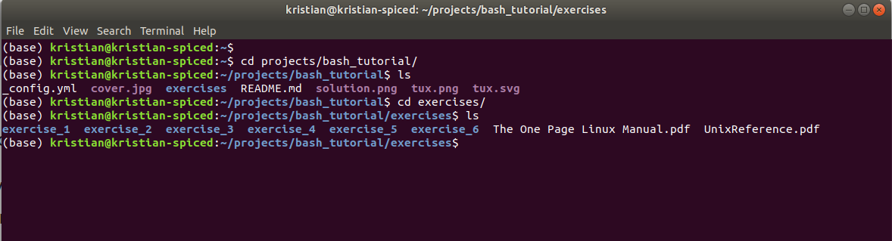

Tutorial Exercises
==================

.. topic:: Goal

   In this tutorial, you will be looking for a word with 22 characters:

   |image0|

   In the exercises below, the characters of the first word are hidden.

.. topic:: Preparations

   - clone the repository or download the code as a ZIP file
   - locate the ``exercises/`` folder
   - open a ``bash`` terminal (on Linux, press `Ctrl + Alt + T`)

   |image1|

1. Directories and files
------------------------

1.1. Navigate directories
~~~~~~~~~~~~~~~~~~~~~~~~~

The **first character** is hidden in a file somewhere in the `exercise_1/` folder.
Use the commands

.. code:: bash

   cd <directory_name>

(do not type the pointy brackets, just insert the directory name) and

.. code:: bash

   ls

to move from one directory to the next. Look through subdirectories
until you find one with the name ``solution_1.1`` and list its contents.
If you went to a wrong directory, you can go back one level by typing:

.. code:: bash

   cd ..

or go back to your home folder:

.. code:: bash

   cd

1.2. Show a hidden file
~~~~~~~~~~~~~~~~~~~~~~~

Some files are not visible immediately. To see them, you need the
command

.. code:: bash

   ls -a

The **second character**, is in the same directory as the first one, but
in a hidden file.

1.3. Execute a program
~~~~~~~~~~~~~~~~~~~~~~

Use cd .. to go back to the directory ``exercise_1/directoryB/``. When
listing its contents, you should see a **shell script file**
``program.sh``. To find the **third character**, you need to execute the
program. On bash, this is done by typing source and the name of the
program:

.. code:: bash

   source program.sh

1.4. Find out how big a file is
~~~~~~~~~~~~~~~~~~~~~~~~~~~~~~~

Go to the folder ``exercise_1/directoryC/``. To find **the fourth
character**, you need to find out how big the text file in the directory
is. This is done with the command

.. code:: bash

   ls -l

In the table the command produces, you will find the file size in bytes,
the file's owner, permissions to read and modify it, and the date/time
of the last modification.

To obtain the fourth character look up the file size in the 
`Table of printable ASCII characters <https://en.wikipedia.org/wiki/ASCII#Printable_characters>`__
(the decimal numbers, not the hex ones):

|image2|

*ASCII Table, Public Domain*

.. note::

   When typing names of directories or files, press ``[TAB]`` after the
   first few characters. Unix tries to guess what you are typing.

--------------

2. Edit text files
------------------

Please use ``cd ..`` to go back to the top directory of the tutorial
material. Then, change to the directory ``exercise_2/``.

2.1. See what is in a text file
~~~~~~~~~~~~~~~~~~~~~~~~~~~~~~~

In the directory ``exercise_2/``, you will find a text file
``solution_2.1.txt``. The **fifth character** is inside that file. To see
its contents, use the command

.. code:: bash

   less <filename>

.. _edit-text-files-1:

2.2. Edit text files
~~~~~~~~~~~~~~~~~~~~

To get **character number six**, you will need to create a text file in
the ``exercise_2`` directory. On Ubuntu, you can do this using the
editor ``nano``. You can start it typing the name of the program, or

.. code:: bash

   nano <filename>

**To exit nano, type Ctrl-X**

Create a text file with the characters you have found so far.

The **sixth character** is the one you need to press to save a file in
``nano``.

.. note::

   If you want to know more about a particular command, type

   .. code:: bash

      man <command>

   You get shown a help page that you can leave by pressing `q`.

--------------

3. Copy and remove files
------------------------

Please go to the directory `exercise_3/`.

3.1. Create a directory and copy a file to it.
~~~~~~~~~~~~~~~~~~~~~~~~~~~~~~~~~~~~~~~~~~~~~~

To find **characters seven and eight**, you need to create a
subdirectory named *solution* in ``exercise_3/`` and copy the files from
the ``part1/`` and ``part2/`` folders into it.

For creating directories, use the command:

.. code:: bash

   mkdir <directory name>

For copying, you can use the command

.. code:: bash

   cp <filename from> <filename to>

Type ``ls -l solution/*`` afterwards to see the solution.

3.2. Remove files
~~~~~~~~~~~~~~~~~

In the ``data`` directory, all files with an ``Y`` need to be deleted.
To do so, use the command:

.. code:: bash

   rm <filename>

Also, there are more files to be deleted in the ``data/`` directory. To
remove more than one file at once, you can use ``*`` as a wildcard, i.e.
``rm ju*`` will delete all of ``junk.txt, juniper.txt`` and
``june.docx``.

To get **characters nine and ten**, look at the files that remain after
deleting all that contain a ``Y``.

.. note::

   To remove an empty directory, you can use

   .. code:: bash

      rmdir <directory name>

   The command

   .. code:: bash

      rm -r <directory name>

   deletes a directory and everything in it.

.. note::

   On Unix, it is not possible to undelete files!

   This makes removing files with the ``*`` symbol **very** dangerous,
   because you could wipe out everything with a single command
   (e.g. if you type the wrong directory by accident).
   Backups become an even
   better idea after learning this command.

--------------

4. Process text data
--------------------

Please go to the directory ``exercise_4/``.

4.1. Compare two files
~~~~~~~~~~~~~~~~~~~~~~

There are two different versions of a quote, ``ai.txt``, and
``artificial_intelligence.txt``. To find out, how they differ, Unix
provides the command

.. code:: bash

   diff <filename1> <filename2>

Of course, you can look at the text first using ``less`` or ``nano``.
The **11th character** of the solution is the single character in which
the two files differ.

4.2. Sort a text file
~~~~~~~~~~~~~~~~~~~~~

Unix has a small program to sort text files alphabetically.
It is called by

.. code:: bash

   less <filename> | sort

The symbol ``|`` is called a pipe and is often used to connect Unix
programs to each other. The **12th character** of the solution is the
first character of the last word in the alphabetically sorted file
``elephant.txt``.

.. note::

   To store the sorted lines in a new file, you can add an output file,
   like

   .. code:: bash

      less <filename> | sort -f > result.txt

4.3. Find words in a text file
~~~~~~~~~~~~~~~~~~~~~~~~~~~~~~

To look for specific words in a text file, use the command

.. code:: bash

   grep <word> <filename>

It produces all lines from the given file that contain the given word.
The ``grep`` command is very powerful and can handle Regular
Expressions.

To find the **13th character**, search for the word **fire** in the file
``datascience.txt`` and take the **first** character of the output.

.. note::

   You can search through many files at once by including a \* in the
   filename.

--------------

5. Unzip files
--------------

Please go to the directory ``exercise_5/``.

5.1. Unzip an archive
~~~~~~~~~~~~~~~~~~~~~

Unzipping compressed files is a very basic and important task. On Unix,
you often encounter ``.zip`` archives, ``.tar`` archives and ``.gz`` compressed
files. For unpacking zip files, use

.. code:: bash

   unzip <filename>

for ``.tar`` and ``.tar.gz`` files

.. code:: bash

   tar -xf <filename>

and for ``.gz`` files,

.. code:: bash

   gunzip <filename>

The **14th and 15th character** of the solution are in a multiply
wrapped archive in the ``exercise_5/`` directory.

.. note::

   To pack a directory and everything within, you can use the command

   .. code:: bash

      tar -cf backup.tar <directory>

   To subsequently compress it, use

   .. code:: bash

      gzip backup.tar

--------------

6. Command-line tools
---------------------

Please go to the directory ``exercise_6/``.

6.1. Change file access rights
~~~~~~~~~~~~~~~~~~~~~~~~~~~~~~

Each file on Unix has separate permissions for reading `r`, writing `w`,
and executing `x`. Displaying them with:

.. code:: bash

   ls -l

There is one triplet of permissions for the owner of the file owner, one
triplet for a group of users, and one for all others. The ``chmod``
command allows to change these permissions, e.g.

.. code:: bash

   chmod a+x <filename>

grants all users the permission to execute a file, while chmod u-w
forbids the current user (oneself) to write to the file (thereby
protecting it from being deleted accidentally).

To see **characters 16+17** of the solution, make the program
``permissions.sh`` executable. Then execute it with:

.. code:: bash

   ./permissions.sh

.. note::

   You can grant permissions for a whole directory tree using

   .. code:: bash

      chmod -R a+x <directory>

6.2. How much disk space have I left?
~~~~~~~~~~~~~~~~~~~~~~~~~~~~~~~~~~~~~

To find out, how much disk space you have left, you can use the command

.. code:: bash

   df

``df`` lists all hard drive partitions, CD-ROMs, pendrives and some
logical partitions Unix uses. All numbers are given in kilobyte (1000
byte or one 1000000th GB).

To obtain the **18th character**, check out the version of the ``df``
program. Find out how to do that with:

.. code:: bash

   df --help

The solution is the last character of the first authors first name.

6.3. Set an environment variable
~~~~~~~~~~~~~~~~~~~~~~~~~~~~~~~~

To install some programs, it is necessary to set so-called environment
variables. These can be set using the command

.. code:: bash

   export <variable-name>=<value>

You can see all variables by the command

.. code:: bash

   env

To obtain the **19th character**, you need to use ``export`` to set the
variable *GIVEME* to the value **SOLUTION**.

.. code:: bash

   echo $GIVEME

Find out the **characters position in the alphabet** with:

.. code:: bash

   echo $GIVEME | wc -c

.. note::

   By default, changes to environment variables only affect the current
   terminal.

   If you want to set environment variables for each console window,
   write the export command to the file ``.bashrc`` in your home
   directory (it is a hidden file).

6.4. Check whether you have internet
~~~~~~~~~~~~~~~~~~~~~~~~~~~~~~~~~~~~

The easiest way to check from the Unix command line whether the internet
connection works, is to send a request to a known server (e.g.
`https://www.academis.eu <https://www.academis.eu>`__) using the command

.. code:: bash

   ping <web address>

The command reports, how long a message takes back and forth to the
given server. To interrupt the messages, press Ctrl+C. You can use the
program

.. code:: bash

   ./check_ping

The **20th character** is the ``ping`` option that sets the maximum
number of requests sent. Check the documentation with:

.. code:: bash

   man ping

6.5. Manage processes
~~~~~~~~~~~~~~~~~~~~~

To see what programs are running on your machine, type

.. code:: bash

   top

It displays you a list of all currently active programs. ``Shift+P`` sorts
them by the CPU time they are using, ``Shift+M`` by the amount of memory
they are using (if you don’t see any program consuming lots of memory,
start a web browser). Quit ``top`` by pressing *q*.

The **last two characters** of the solution are the first two characters
of the second word in the line containing the column labels.

.. note::

   If you want to get rid of one of the programs you started
   (e.g. because it crashed), you can do so by typing

   .. code:: bash

      kill -s 9 <pid>

You find the pid number in the first column of the ``top`` output. Of
course, you may only interrupt your own programs, not those owned by
*root*, the system administrator.

.. |image2| image:: images/ASCII-Table-wide.svg

